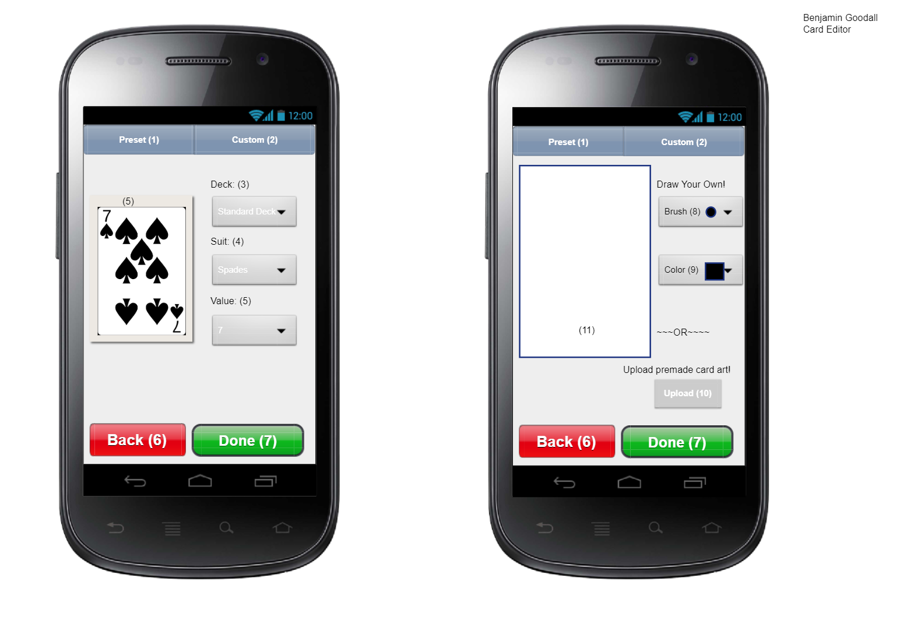
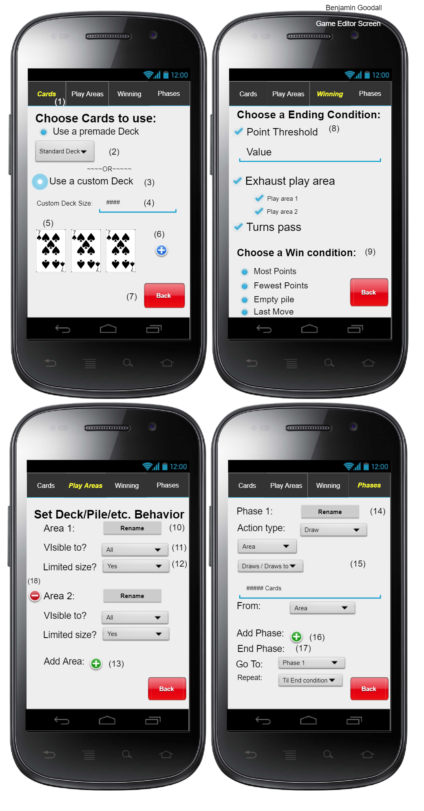

# Card Game Maker

# Description
Game similar to Super Mario Maker, but uses card.

Our project will give users the ability to create any type of card games from trading games, gambling games, and etc. It will allow users to create an account to make games, follow other users, customize card decks, and play other users games. There will be an area to find games from default games, popular games, and brand new games.
There will be three different types of users the Players, Creators, and Moderator.

The players play any of the games that have been posted and will be able to have a live chat with the other players currently playing. They also can give the ratings to the card game and give a feedback to the Creators. 

Creators have the ability to create any kind of gamethat they would like and can choose from customized decks to the default deck of cards.

Moderators will be monitoring the new decks of cards and games and need to beapproved before being published.

# Tasks
## Spring Boot 
  * Each card game should have multi users
     
## Android Studio - User interface
      
   card edit page   
      
      
   game edit page
   
   ### For more details
   * [Card Editor Mockup](./hv_4/Documents/03_Card_Editor_Mockup.pdf)
   * [Card Editor Mockup](./hv_4/Documents/06_Game_Editor_Mockup.pdf)
   * [Screen Sketches](./hv_4/Documents/05_Screen_Sketches.pdf)
   * [Block Diagram](./hv_4/Documents/09_Block_Diagram.pdf)
   

   
## Web Sockets
 * To create chatting/gaming rooms for players
 * Players are connected themselves not by creating rooms in the server
      
## Used Library
 * Mockito - for testing
